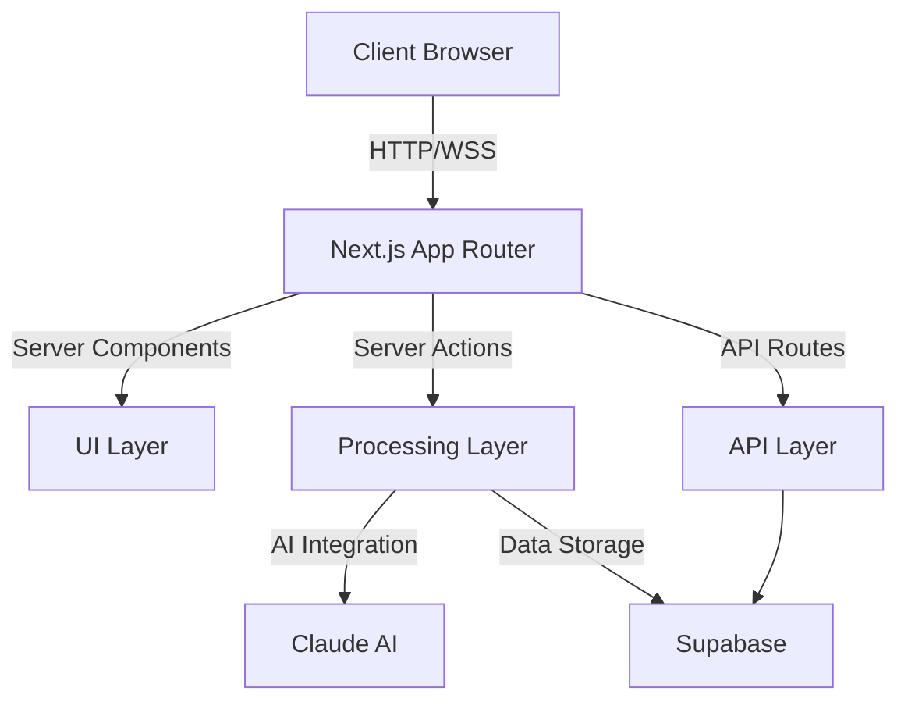

# Mozzy Architecture Documentation

_Last Updated: 2025-02-08 15:43_

## Overview

Mozzy is an AI-powered content transformation platform built with Next.js 14, leveraging modern web technologies and AI capabilities to help creators repurpose their content across different formats and platforms.

## System Architecture

### High-Level Architecture



### Core Components

1. **Frontend Layer (Next.js 14)**

   - Server Components (Default)
   - Client Components (Interactive UI)
   - App Router Structure
   - shadcn/UI Components
   - Zustand State Management

2. **Processing Layer**

   - Content Transformation Engine
   - AI Integration (Claude)
   - Processing Strategies
   - Format-specific Adapters
   - Template System

3. **Data Layer (Supabase)**
   - PostgreSQL Database
   - Authentication
   - Storage
   - Real-time Subscriptions

## Directory Structure

```
/app
├── actions/        # Server actions
├── api/           # API routes
├── components/    # UI components
│   ├── blocks/    # Content blocks
│   └── ui/        # shadcn/UI components
├── core/          # Core processing logic
├── config/        # Configuration
├── constants/     # Constants
├── hooks/         # React hooks
├── services/      # Business logic
├── stores/        # Zustand stores
├── types/         # TypeScript types
└── utils/         # Utilities
```

## Key Technologies

- **Frontend**: Next.js 14, TypeScript, Tailwind CSS
- **UI Library**: shadcn/UI
- **State Management**: Zustand
- **AI Integration**: Claude AI (Anthropic)
- **Database**: Supabase (PostgreSQL)
- **Testing**: Jest

## Processing Pipeline

### Content Processing Flow

1. **Input Processing**

   - Content validation
   - Format detection
   - Initial preprocessing

2. **AI Processing**

   - Content analysis
   - Transformation
   - Enhancement
   - Template application

3. **Output Generation**
   - Format-specific adaptation
   - Quality checks
   - Metadata generation

### Processing Strategies

Different strategies are employed based on content type:

- **Podcast Processing**

  - Transcription handling
  - Segment identification
  - Highlight extraction

- **Post Processing**
  - Content analysis
  - Format transformation
  - Platform adaptation

## Security Architecture

1. **Authentication**

   - Supabase authentication
   - JWT token management
   - Session handling

2. **Authorization**

   - Role-based access control
   - Resource-level permissions
   - API endpoint protection

3. **Data Security**
   - Encrypted storage
   - Secure API communication
   - Environment variable management

## Performance Considerations

1. **Frontend Optimization**

   - Server Components for performance
   - Code splitting
   - Image optimization
   - Caching strategies

2. **Processing Optimization**

   - Batch processing
   - Queue management
   - Resource allocation
   - Cache utilization

3. **Database Optimization**
   - Query optimization
   - Index management
   - Connection pooling

## Monitoring and Observability

1. **Logging System**

   - Centralized logging
   - Error tracking
   - Performance monitoring
   - User analytics

2. **Alerting**
   - Critical system alerts
   - Performance degradation
   - Error rate monitoring
   - Resource utilization

## Development Workflow

1. **Local Development**

   - Environment setup
   - Development server
   - Hot reloading
   - Type checking

2. **Testing**

   - Unit tests
   - Integration tests
   - E2E testing
   - Performance testing

3. **Deployment**
   - CI/CD pipeline
   - Environment management
   - Version control
   - Release process

## Related Documentation

- [API Documentation](../api/README.md)
- [Component Documentation](../components/README.md)
- [Security Guidelines](../security/README.md)
- [Development Guide](../guides/README.md)

## Contributing

See the [Contributing Guide](../guides/contributing.md) for detailed information about contributing to the architecture.

## Version History

- 2025-02-08: Initial architecture documentation
- Future updates will be logged here
