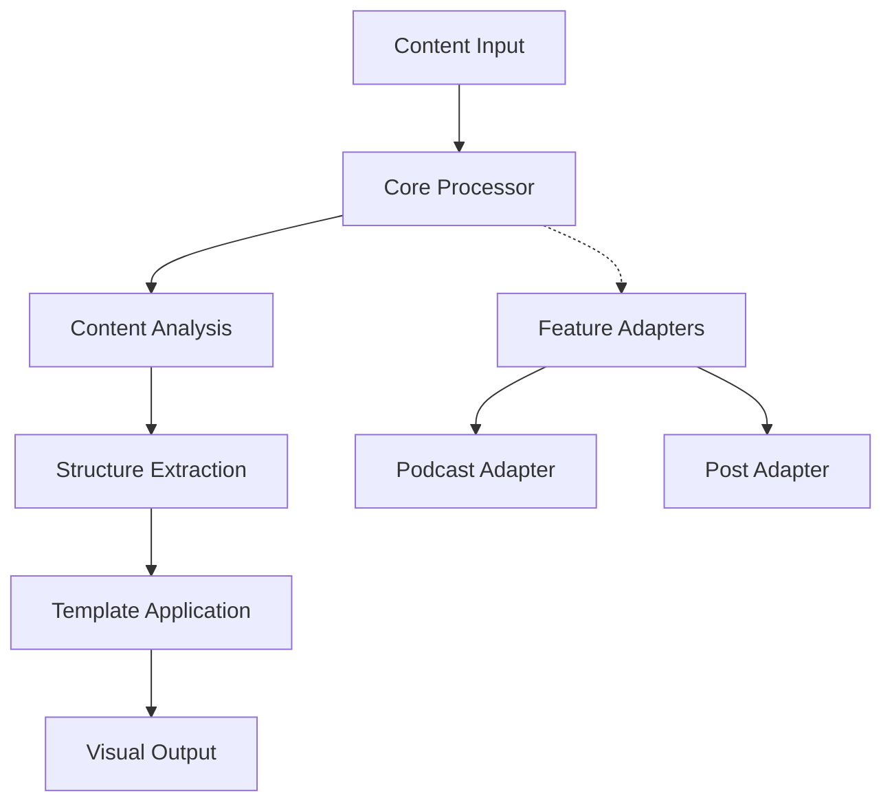
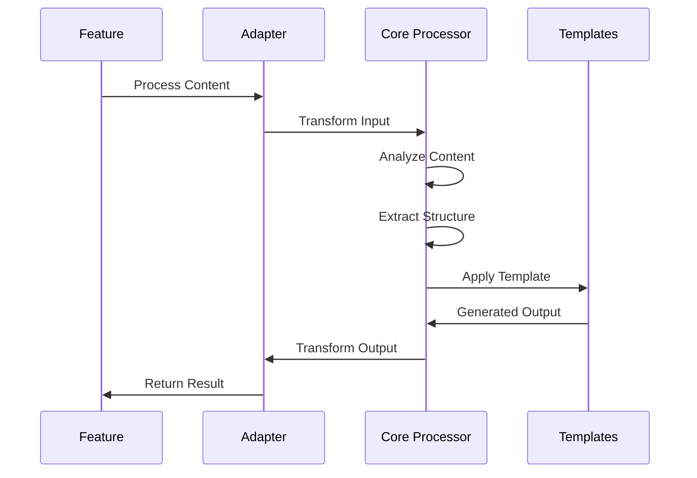

# Core Processing Architecture

## System Design

### High-Level Overview

The core processing module is designed as a shared library that provides content transformation capabilities across different features. It follows a modular architecture with:



### Key Components

1. **Core Processor**

   - Central processing engine
   - Content type agnostic
   - Pipeline orchestration
   - State management

2. **Feature Adapters**

   - Feature-specific implementations
   - Custom processing rules
   - Input/output transformations
   - Feature-specific optimizations

3. **Processing Pipeline**
   - Content analysis
   - Structure extraction
   - Template application
   - Visual generation

## Technical Design

### Processing Flow



### Design Patterns

1. **Adapter Pattern**

   - Feature-specific adapters
   - Common interface
   - Specialized processing
   - Custom configurations

2. **Pipeline Pattern**

   - Sequential processing
   - Modular stages
   - Error handling
   - Progress tracking

3. **Template Method Pattern**
   - Customizable processing steps
   - Common workflow
   - Extension points
   - Feature overrides

## Implementation Details

### Core Interfaces

```typescript
interface ContentProcessor {
  process(input: ContentInput): Promise<ProcessedContent>;
  analyze(content: RawContent): Promise<AnalyzedContent>;
  extract(analyzed: AnalyzedContent): Promise<StructuredContent>;
  transform(structured: StructuredContent): Promise<VisualContent>;
}

interface FeatureAdapter {
  adapt(input: any): ContentInput;
  transform(output: VisualContent): any;
  getConfig(): ProcessingConfig;
}
```

### Processing Stages

1. **Input Processing**

   - Content validation
   - Format detection
   - Initial cleanup
   - Metadata extraction

2. **Content Analysis**

   - Structure detection
   - Content classification
   - Key point extraction
   - Relationship mapping

3. **Template Application**
   - Template selection
   - Content mapping
   - Style application
   - Output generation

## Dependencies

### Internal Dependencies

- Template engine
- Content analyzers
- Structure extractors
- Visual generators

### External Services

- Text processing APIs
- Media transformation services
- Storage solutions
- Analytics services

## Configuration

### Processing Options

```typescript
interface ProcessingConfig {
  analysisDepth: "basic" | "detailed";
  outputFormat: "markdown" | "html" | "json";
  templateId: string;
  featureSpecific: Record<string, any>;
}
```

### Feature-Specific Settings

- Custom processing rules
- Template preferences
- Output formatting
- Performance tuning

## Security Considerations

1. **Input Validation**

   - Content sanitization
   - Size limits
   - Format validation
   - Source verification

2. **Processing Safety**

   - Resource limits
   - Timeout handling
   - Error recovery
   - Audit logging

3. **Output Security**
   - Content sanitization
   - XSS prevention
   - Safe template rendering
   - Output validation
