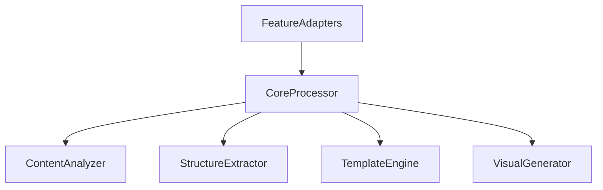

# Core Processing Components

## Component Overview

The core processing feature is composed of several key components that work together to provide content transformation capabilities:



## Core Components

### CoreProcessor

```typescript
export class CoreProcessor implements ContentProcessor {
  constructor(
    private analyzer: ContentAnalyzer,
    private extractor: StructureExtractor,
    private templateEngine: TemplateEngine,
    private visualGenerator: VisualGenerator
  ) {}

  async process(input: ContentInput): Promise<ProcessedContent>;
  async analyze(content: RawContent): Promise<AnalyzedContent>;
  async extract(analyzed: AnalyzedContent): Promise<StructuredContent>;
  async transform(structured: StructuredContent): Promise<VisualContent>;
}
```

**Purpose**: Central orchestrator for the processing pipeline
**Location**: `/app/features/core-processing/CoreProcessor.ts`
**Usage**: Main entry point for content processing

### ContentAnalyzer

```typescript
export interface ContentAnalyzer {
  analyze(content: RawContent): Promise<AnalyzedContent>;
  detectStructure(content: RawContent): Promise<ContentStructure>;
  extractMetadata(content: RawContent): Promise<ContentMetadata>;
}
```

**Purpose**: Analyzes raw content to understand its structure and meaning
**Location**: `/app/features/core-processing/analyzers/`
**Usage**: Content understanding and classification

### StructureExtractor

```typescript
export interface StructureExtractor {
  extract(content: AnalyzedContent): Promise<StructuredContent>;
  identifySegments(content: AnalyzedContent): Promise<ContentSegment[]>;
  mapRelationships(segments: ContentSegment[]): Promise<SegmentRelationships>;
}
```

**Purpose**: Extracts structured information from analyzed content
**Location**: `/app/features/core-processing/extractors/`
**Usage**: Converting raw content into structured format

### TemplateEngine

```typescript
export interface TemplateEngine {
  applyTemplate(
    content: StructuredContent,
    templateId: string
  ): Promise<TemplatedContent>;
  getTemplate(templateId: string): Promise<Template>;
  validateContent(content: StructuredContent, template: Template): boolean;
}
```

**Purpose**: Applies templates to structured content
**Location**: `/app/features/core-processing/templates/`
**Usage**: Visual presentation and formatting

### VisualGenerator

```typescript
export interface VisualGenerator {
  generate(content: TemplatedContent): Promise<VisualContent>;
  optimizeMedia(content: TemplatedContent): Promise<OptimizedMedia>;
  validateOutput(content: VisualContent): Promise<ValidationResult>;
}
```

**Purpose**: Generates final visual output
**Location**: `/app/features/core-processing/generators/`
**Usage**: Final content generation and optimization

## Feature Adapters

### Base Adapter

```typescript
export abstract class BaseFeatureAdapter implements FeatureAdapter {
  abstract adapt(input: any): ContentInput;
  abstract transform(output: VisualContent): any;
  abstract getConfig(): ProcessingConfig;

  protected validateInput(input: any): boolean;
  protected sanitizeOutput(output: any): any;
}
```

### PodcastAdapter

```typescript
export class PodcastAdapter extends BaseFeatureAdapter {
  adapt(podcast: PodcastInput): ContentInput;
  transform(output: VisualContent): PodcastOutput;
  getConfig(): ProcessingConfig;
}
```

### PostAdapter

```typescript
export class PostAdapter extends BaseFeatureAdapter {
  adapt(post: PostInput): ContentInput;
  transform(output: VisualContent): PostOutput;
  getConfig(): ProcessingConfig;
}
```

## Utility Components

### ProcessingQueue

```typescript
export interface ProcessingQueue {
  add(task: ProcessingTask): Promise<string>;
  getStatus(taskId: string): Promise<TaskStatus>;
  cancel(taskId: string): Promise<void>;
}
```

### ProgressTracker

```typescript
export interface ProgressTracker {
  updateProgress(taskId: string, progress: number): void;
  getProgress(taskId: string): number;
  onProgress(taskId: string, callback: ProgressCallback): void;
}
```

## State Management

### ProcessingState

```typescript
interface ProcessingState {
  tasks: Map<string, TaskStatus>;
  progress: Map<string, number>;
  errors: Map<string, Error>;
}
```

### Configuration State

```typescript
interface ConfigurationState {
  defaultConfig: ProcessingConfig;
  featureConfigs: Map<string, ProcessingConfig>;
  templates: Map<string, Template>;
}
```

## Event Handling

### ProcessingEvents

```typescript
enum ProcessingEvent {
  TASK_STARTED = "task_started",
  TASK_PROGRESS = "task_progress",
  TASK_COMPLETED = "task_completed",
  TASK_FAILED = "task_failed",
}
```

### Event Handlers

```typescript
interface ProcessingEventHandlers {
  onTaskStarted(taskId: string): void;
  onTaskProgress(taskId: string, progress: number): void;
  onTaskCompleted(taskId: string, result: ProcessedContent): void;
  onTaskFailed(taskId: string, error: Error): void;
}
```
