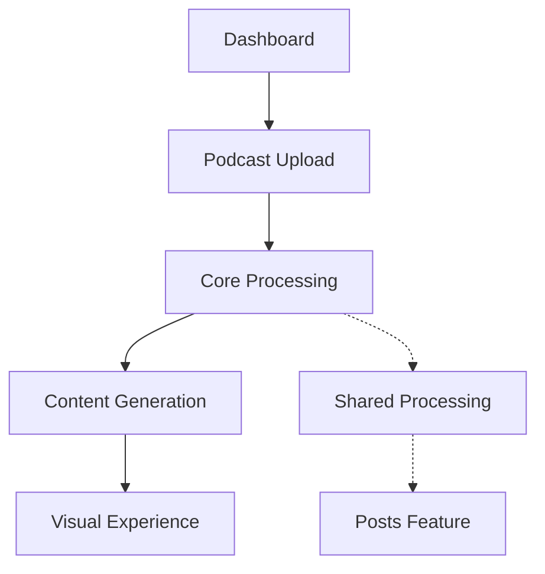

# Podcast Feature Architecture

## System Design

### High-Level Overview

The podcast feature is built on a modular architecture that separates concerns between:

- Upload and storage
- Processing and transformation
- Content presentation
- User interaction

### Component Relationships

## Technical Decisions

### Technology Choices

- **Next.js 14**: Server components for efficient rendering
- **Core Processing**: Shared module for content transformation
- **TypeScript**: Type safety across the feature
- **Tailwind CSS**: Responsive design implementation

### Design Patterns

1. **Server Components First**

   - Default to server components
   - Client components only when necessary
   - Efficient data loading patterns

2. **Shared Processing Core**

   - Modular processing system
   - Reusable across features
   - Extensible transformation pipeline

3. **Content Templates**
   - Standardized output formats
   - Customizable templates
   - Consistent visual presentation

## Dependencies

### External Services

- Audio processing services
- Content transformation APIs
- Storage solutions

### Internal Dependencies

- Core processing module
- Content templating system
- UI components library

### Configuration Requirements

- Audio processing settings
- Transformation parameters
- Template configurations
