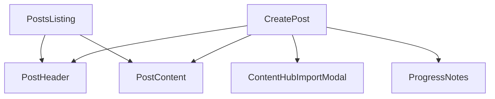

# Social Posts Architecture

## System Design

### Overview

The Social Posts feature follows a modular architecture with clear separation of concerns:

```
app/dashboard/posts/
├── page.tsx           # Main posts listing
├── layout.tsx         # Posts layout wrapper
├── [id]/             # Individual post routes
│   ├── page.tsx      # View post
│   └── edit/         # Edit post
└── create/           # Create new post
```

### Component Relationships



## Technical Decisions

### State Management

- Using Zustand for global post state management
- Client-side state for form handling
- Server actions for data persistence

### Data Flow

1. Podcast content import via ContentHub
2. Content processing and entity extraction
3. Template merging
4. Post generation and preview
5. Save and publication

## Dependencies

### External Services

- Content processing pipeline
- Entity extraction service
- Template management system

### Internal Dependencies

- PostStore (Zustand)
- Server Actions
- UI Components
- Authentication system

## Performance Considerations

- Lazy loading of post content
- Optimistic updates for better UX
- Cached template access
- Efficient content processing pipeline
