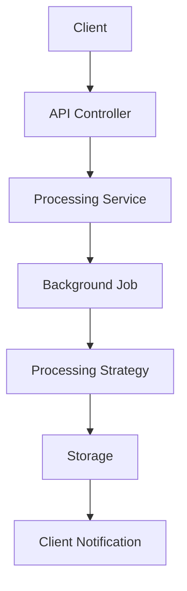
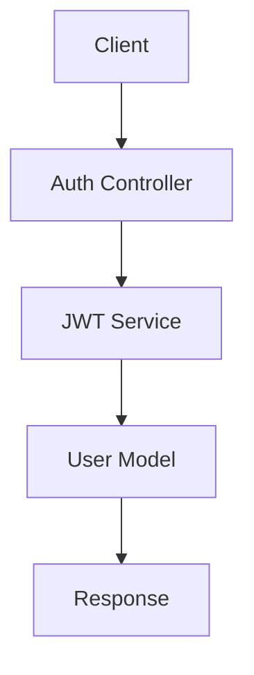
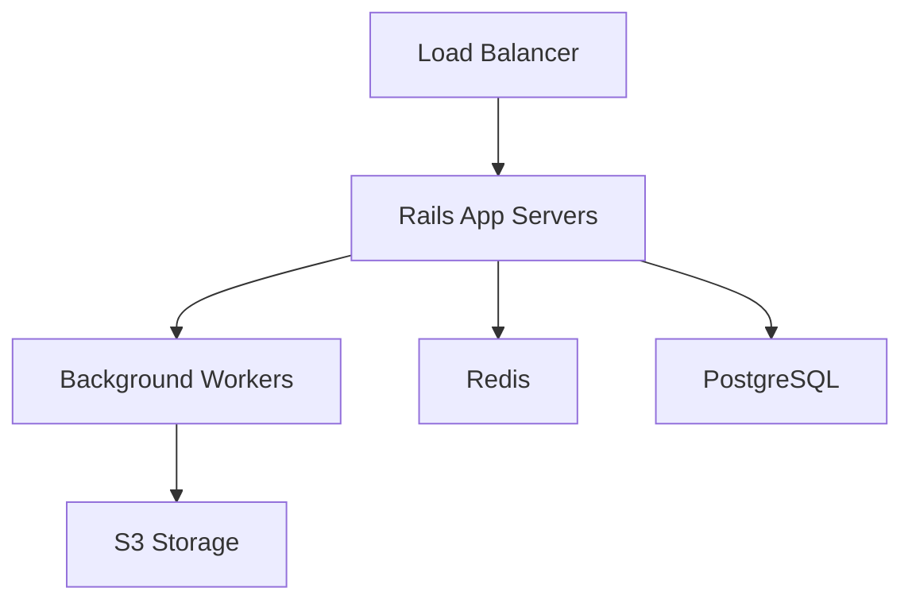

# SocialScript Architecture

## System Overview

SocialScript is a Rails-based content transformation platform that helps creators repurpose their content across different formats and platforms. This document outlines the architectural decisions and system design for the Rails migration.

## Component Architecture

```
SocialScript
├── Web Layer
│   ├── Controllers (API endpoints)
│   ├── Policies (Authorization)
│   └── Serializers (JSON responses)
│
├── Domain Layer
│   ├── Models (ActiveRecord)
│   ├── Services (Business logic)
│   └── Validators (Data validation)
│
├── Processing Layer
│   ├── Processors (Content transformation)
│   ├── Strategies (Processing algorithms)
│   └── Adapters (Format conversion)
│
└── Infrastructure
    ├── Background Jobs
    ├── Storage
    └── External Services
```

## Data Flow

### 1. Content Processing Flow



### 2. Authentication Flow



## Component Relationships

### 1. Models

```ruby
# app/models/user.rb
class User < ApplicationRecord
  has_many :podcasts
  has_many :posts
  has_many :templates
end

# app/models/podcast.rb
class Podcast < ApplicationRecord
  belongs_to :user
  has_many :episodes
  has_one :processing_record, as: :processable
end

# app/models/post.rb
class Post < ApplicationRecord
  belongs_to :user
  has_one :processing_record, as: :processable
  has_many :templates
end
```

### 2. Services

```ruby
# app/services/processing/base_service.rb
module Processing
  class BaseService
    def initialize(record)
      @record = record
    end

    def process
      # Processing logic
    end
  end
end

# app/services/processing/podcast_service.rb
module Processing
  class PodcastService < BaseService
    # Podcast-specific processing
  end
end
```

## Security Model

### 1. Authentication

```ruby
# app/controllers/concerns/authenticatable.rb
module Authenticatable
  extend ActiveSupport::Concern

  included do
    before_action :authenticate_user!
  end

  private

  def authenticate_user!
    # JWT authentication logic
  end
end
```

### 2. Authorization

```ruby
# app/policies/application_policy.rb
class ApplicationPolicy
  attr_reader :user, :record

  def initialize(user, record)
    @user = user
    @record = record
  end
end

# app/policies/podcast_policy.rb
class PodcastPolicy < ApplicationPolicy
  def process?
    user.can_process_podcasts?
  end
end
```

## Performance Considerations

### 1. Background Processing

```ruby
# app/jobs/processing_job.rb
class ProcessingJob < ApplicationJob
  queue_as :processing

  def perform(record_id)
    record = ProcessingRecord.find(record_id)
    appropriate_service(record).process
  end

  private

  def appropriate_service(record)
    "Processing::#{record.processable_type}Service".constantize
  end
end
```

### 2. Caching Strategy

```ruby
# app/models/concerns/cacheable.rb
module Cacheable
  extend ActiveSupport::Concern

  included do
    after_commit :clear_cache
  end

  def cached_data
    Rails.cache.fetch(cache_key) { compute_data }
  end
end
```

## Error Handling

### 1. Global Error Handling

```ruby
# app/controllers/concerns/error_handler.rb
module ErrorHandler
  extend ActiveSupport::Concern

  included do
    rescue_from StandardError do |e|
      handle_error(e)
    end
  end

  private

  def handle_error(error)
    # Error handling logic
  end
end
```

### 2. Domain-Specific Errors

```ruby
# app/errors/processing_error.rb
module Errors
  class ProcessingError < StandardError
    attr_reader :details

    def initialize(message, details = {})
      @details = details
      super(message)
    end
  end
end
```

## Monitoring & Observability

### 1. Application Monitoring

```ruby
# config/initializers/monitoring.rb
Rails.application.configure do
  config.after_initialize do
    # Setup monitoring
  end
end
```

### 2. Performance Tracking

```ruby
# app/controllers/concerns/trackable.rb
module Trackable
  extend ActiveSupport::Concern

  included do
    around_action :track_performance
  end

  private

  def track_performance
    # Performance tracking logic
  end
end
```

## Development Guidelines

### 1. Code Organization

- Controllers handle HTTP interactions
- Services contain business logic
- Models define data relationships
- Jobs handle background processing
- Policies manage authorization

### 2. Testing Strategy

```ruby
# spec/services/processing/podcast_service_spec.rb
RSpec.describe Processing::PodcastService do
  describe '#process' do
    context 'with valid input' do
      it 'processes successfully' do
        # Test implementation
      end
    end
  end
end
```

## Deployment Architecture

### 1. Production Environment



### 2. Scaling Strategy

- Horizontal scaling of app servers
- Separate background job workers
- Redis for caching and job queues
- PostgreSQL with read replicas if needed

## Integration Points

### 1. External Services

```ruby
# config/initializers/external_services.rb
Rails.application.configure do
  config.external_services = {
    transcription: ENV['TRANSCRIPTION_SERVICE_URL'],
    storage: ENV['STORAGE_SERVICE_URL']
  }
end
```

### 2. API Clients

```ruby
# app/clients/base_client.rb
class BaseClient
  def initialize
    # Client initialization
  end
end

# app/clients/transcription_client.rb
class TranscriptionClient < BaseClient
  def transcribe(audio_file)
    # Transcription logic
  end
end
```

## Configuration Management

### 1. Environment Variables

```ruby
# config/application.rb
module SocialScript
  class Application < Rails::Application
    config.require_master_key = true
    config.eager_load_paths << Rails.root.join('lib')
  end
end
```

### 2. Feature Flags

```ruby
# config/features.yml
default: &default
  features:
    new_processor: false
    advanced_auth: false

development:
  <<: *default
  features:
    new_processor: true

production:
  <<: *default
```

## Documentation Requirements

When updating this architecture:

1. Update component diagrams
2. Document new relationships
3. Update security considerations
4. Review performance implications
5. Update deployment notes
