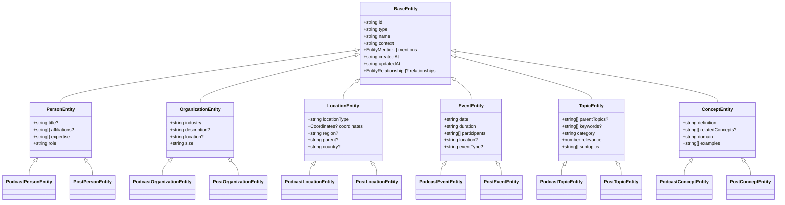
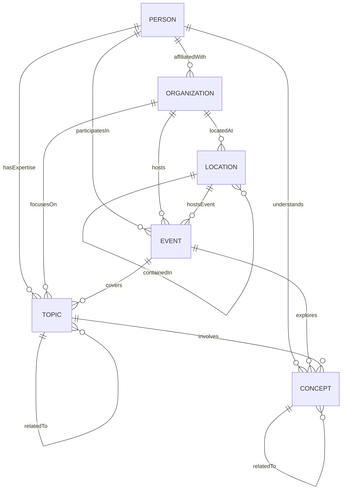
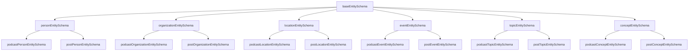

# Entity Type System Relationships

Last Updated: 2025-02-08 16:20

## Type Hierarchy



## Entity Relationships



## Base Entity Structure

### Common Fields

All entity types extend BaseEntity, which provides:

1. **Core Identity**:

   - `id`: Unique identifier
   - `type`: Entity type classification
   - `name`: Display name
   - `context`: Contextual information

2. **Temporal Data**:

   - `createdAt`: Creation timestamp
   - `updatedAt`: Last update timestamp

3. **References**:
   - `mentions`: Array of entity mentions
   - `relationships`: Optional array of relationships

### Entity Mentions

```typescript
interface EntityMention {
  text: string;
  sentiment: "positive" | "negative" | "neutral";
  timestamp?: string;
}
```

### Entity Relationships

```typescript
interface EntityRelationship {
  entity: string;
  relationship: string;
  context?: string;
}
```

## Feature-Specific Extensions

### Podcast Extensions

Podcast-specific entity types add fields relevant to audio content:

1. **PodcastPersonEntity**:

   - `appearances`: Timestamps and durations
   - `speakingTime`: Speaking percentage
   - `interactions`: Speaker interaction count

2. **PodcastLocationEntity**:

   - `mentionTimestamps`: When location is referenced
   - `relevance`: Location importance score

3. **PodcastEventEntity**:
   - `segments`: Related audio segments
   - `participantSpeakingTime`: Speaking time per participant

### Post Extensions

Post-specific entity types add fields relevant to written content:

1. **PostPersonEntity**:

   - `socialProfiles`: Social media links
   - `authoredPosts`: Related content
   - `bio`: Author biography
   - `imageUrl`: Profile image

2. **PostLocationEntity**:

   - `slug`: SEO-friendly URL
   - `imageUrl`: Location image

3. **PostEventEntity**:
   - `url`: Event page link
   - `registrationUrl`: Sign-up link

## Validation Hierarchy



## Implementation Notes

1. **Type Safety**:

   - Use `Extract<EntityType, "TYPE">` for type field
   - Maintain strict validation schemas
   - Enforce required vs optional fields

2. **Extension Pattern**:

   - Base types define core fields
   - Feature types extend with specific fields
   - No duplication in extensions

3. **Validation Flow**:

   - Base schema validates common fields
   - Extended schemas add feature-specific validation
   - Combined schemas for bulk validation

4. **Documentation Requirements**:
   - JSDoc comments on all interfaces
   - Field-level documentation
   - Validation rules documented
   - Example usage provided
